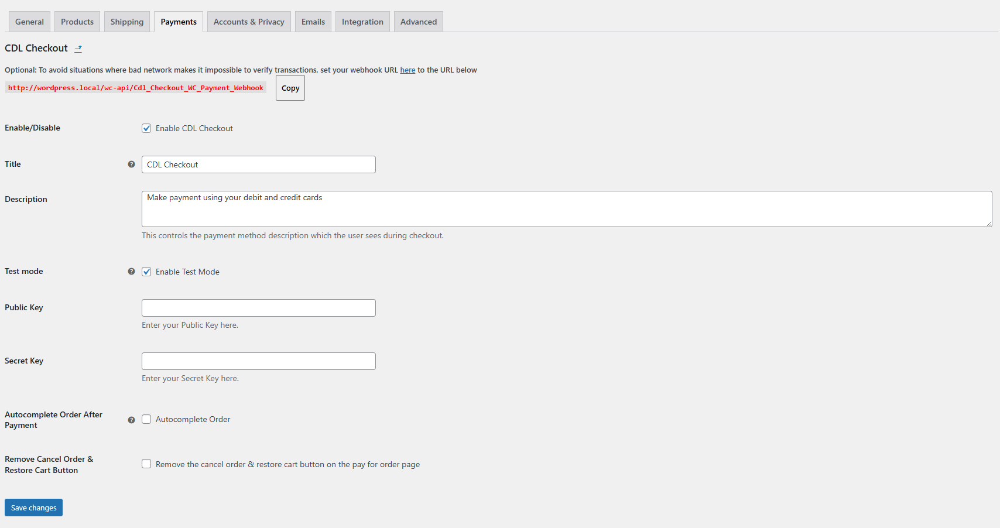
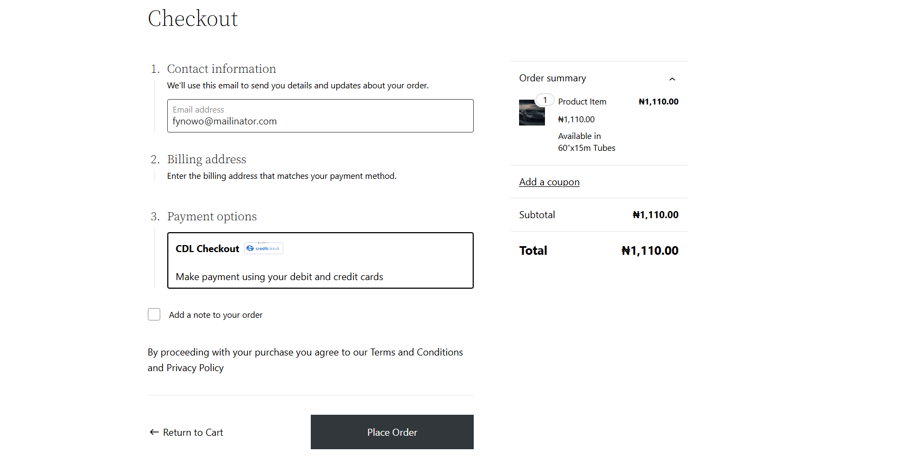
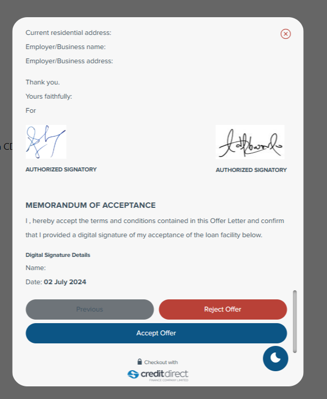

    

# CDL Checkout Payment Gateway for WooCommerce

- **Contributors:** Credit Direct, Shadrach Odekhiran
- **Tags:** credit direct, cdl-checkout, cdl checkout, woocommerce, payment, payment gateway, credit card, debit card, international, mastercard, visa
- **Requires at least:** 4.4
- **Tested up to:** 6.5.5
- **Stable tag:** 1.4.2
- **License:** GPL-2.0+
- **License URI:** https://www.gnu.org/licenses/gpl-2.0.html

Take payments on your store using CDL Checkout.

## Description

Transform your online store with CDL Checkout for WooCommerce. Easily accept credit card and debit card payments through a variety of digital channels—USSD, mobile apps, and web platforms. Enhance your customers' payment experience with secure and efficient transactions using the CDL Checkout payment gateway

#### Take Credit card payments easily and directly on your store

Signup for an account [here](https://creditdirect.ng)

CDL Checkout is available internationally.

## Installation

### Automatic Installation

- Login to your WordPress Dashboard.
- Click on "Plugins > Add New" from the left menu.
- In the search box type **CDL Checkout for WooCommerce**.
- Click on **Install Now** on **CDL Checkout for WooCommerce** to install the plugin on your site.
- Confirm the installation.
- Activate the plugin.
- Click on "WooCommerce > Settings" from the left menu and click the **"Payments"** tab.
- Click on the **CDL Checkout** link from the available Checkout Options.
- Configure your **CDL Checkout Payment Gateway** settings accordingly.

### Manual Installation

- Download the plugin zip file.
- Login to your WordPress Admin. Click on "Plugins > Add New" from the left menu.
- Click on **Upload Plugin** button at the top.
- Choose the downloaded zip file of the plugin and click **Install Now**.
- Confirm the installation and activate the plugin.
- Click on "WooCommerce > Settings" from the left menu and click the **"Payments"** tab.
- Click on the **CDL Checkout** link from the available Checkout Options.
- Configure your **CDL Checkout Payment Gateway** settings accordingly.

## Configuration

- **Enable/Disable** - Tick to enable CDL Checkout.
- **Title** - This controls the title which the user sees during checkout.
- **Description** - This controls the description which the user sees during checkout.
- **Test Mode** - Tick to enable test mode for transactions. When enabled, the provided public key and secret key will be used in test mode.
- **Public Key** - Enter your public key. This key will be used for both test and live transactions depending on the Test Mode setting.
- **Secret Key** - Enter your secret key. This key will be used for both test and live transactions depending on the Test Mode setting.
- Click **Save Changes** to save your changes.

## Screenshots

##### 1. CDL Checkout WooCommerce Payment Gateway Setting Page

##### 2. CDL Checkout WooCommerce Payment Gateway on WooCommerce order checkout page

##### 3. CDL Checkout pay modal showing card payment option

### Suggestions / Contributions

To contribute, fork the repo, add your changes and modifications then create a pull request.

### Changelog

= 1.4.2 - July 02, 2024 =
*   First release